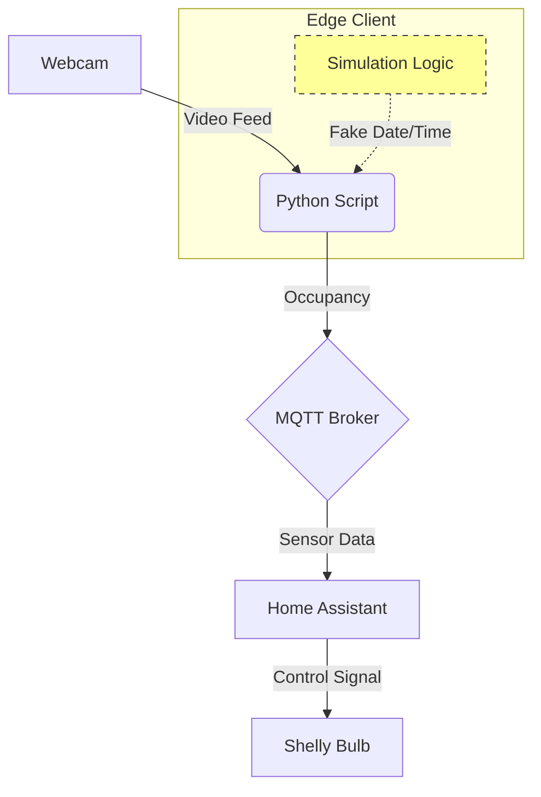

# Smart Home & Occupancy Automation Project

A smart home solution that utilizes Edge Computing to adapt lighting based on real-time human presence and environmental conditions.

## Project Overview
To expand our project, we initially attempted to create a video surveillance solution using Frigate NVR on a Linux Docker host to utilize hardware-accelerated computer vision (GPU). However, due to persistent driver conflicts, we pivoted to a more efficient **edge-computing strategy**.

We developed a custom Python script using the **MediaPipe** library to perform real-time person detection locally on the client device. This effectively converts a standard webcam into a smart IoT sensor. The client transmits binary occupancy status alongside simulated environmental telemetry (temperature, humidity, and season) to Home Assistant via MQTT.

## System Architecture
Instead of processing video on a central server, we implemented a distributed system where the "Client" (laptop with webcam) processes video locally and sends minimal data to the "Server" (Home Assistant).



**The Data Flow:**
1.  **Sensing:** The Python script captures video from the webcam.
2.  **Processing:** MediaPipe analyzes frames locally. If a person is detected (>50% confidence), the room is flagged as "Occupied."
3.  **Communication:** The script publishes status and simulated environmental data to the MQTT Broker.
4.  **Action:** Home Assistant receives this data and controls a Shelly Vintage Bulb based on our Master Automation logic.

## 3. Automation Logic (The "Master" Controller)
To manage smart home logic without conflicts, we implemented a **Strict Priority Logic** in Home Assistant:

1.  **Priority 1: Manual Override**
    If the user activates "Manual Mode," automatic logic is instantly disabled. The user has full control via the dashboard.
2.  **Priority 2: Energy Saving (Empty Room)**
    If Manual Mode is OFF and the room is **Empty**, the system cuts power to the lights immediately to prevent energy waste.
3.  **Priority 3: Adaptive Lighting (Occupied Room)**
    If the room is **Occupied**, the system calculates brightness based on context:
    * *Cold Weather (<15°C):* Bright, warm light (100%).
    * *Hot Weather (>15°C):* Dimmer light (40-50%).

---

## Getting Started

### Prerequisites
* Python 3.10+
* A webcam (for detection mode)
* MQTT Broker (e.g., Mosquitto in Home Assistant)

### Installation

1.  **Create a virtual environment (Recommended):**
    ```bash
    python3 -m venv venv
    source venv/bin/activate  # On Windows use: venv\Scripts\activate
    ```

2.  **Install dependencies:**
    ```bash
    pip install -r requirements.txt
    ```

3.  **Download the AI Model:**
    You must download `efficientdet_lite0.tflite` and place it in the root folder.
    [Download Link](https://storage.googleapis.com/mediapipe-models/object_detector/efficientdet_lite0/float16/1/efficientdet_lite0.tflite)

### Configuration
Open `mqtt_publisher.py` to update your MQTT settings:
```python
BROKER = "192.168.68.xxx"
USERNAME = "user"
PASSWORD = "password"
```

## Usage

**Option 1: Simulation Only (No Camera)**
Sends random temperature, humidity, and time data only. Useful for testing Home Assistant triggers without a webcam.

```bash
python3 mqtt_publisher.py
```

**Option 2: AI Detection Mode (Camera On)**
Activates the webcam to detect people in real-time while also sending environmental data.

```bash
python3 mqtt_publisher.py --detection
```

**Option 3: The "Time Machine" (Demo Mode)**
Combines AI detection with a fast-forwarding clock. The date advances by 1 hour every 2 seconds.
- Quickly demonstrate how Home Assistant reacts to changing seasons (e.g., watching the light dim as the simulated date moves from Winter to Summer).
- Controls: Press `s` in the video window to jump forward manually.

```bash
python3 mqtt_publisher.py --detection --simulation
```

## Testing & Validation
We implemented two methods to verify system reliability:
- Real-World Testing: Verifying computer vision by walking in/out of the camera frame. The system correctly identifies presence within milliseconds.
- The "Simulator" Button: A virtual button in the Home Assistant dashboard that forces the "Occupied" state. This allows us to verify that the light bulb responds correctly to temperature changes (e.g., changing the season from "Summer" to "Winter") without needing to stand in front of the camera constantly.
- Temporal Simulation: To validate the seasonal lighting logic without waiting for actual months to pass, we implemented a "Time Simulation Mode" in our Python client. This feature accelerates the system clock (advancing 1 hour every 2 seconds), allowing us to observe and verify the automation's behavior across a full calendar year in just a few minutes of real-time testing.